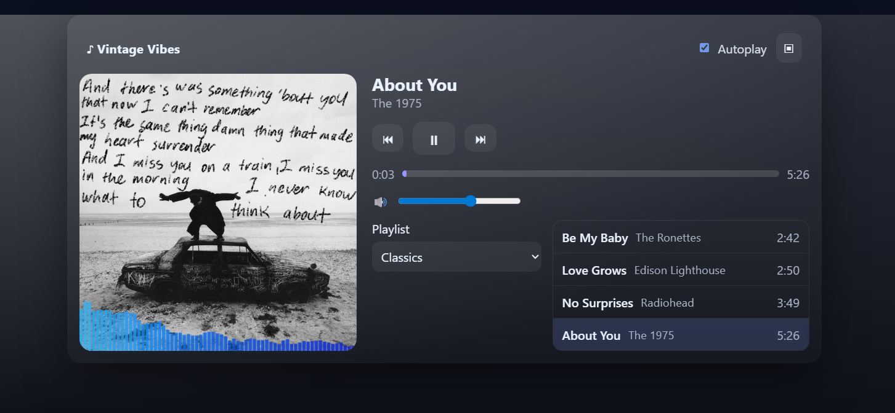
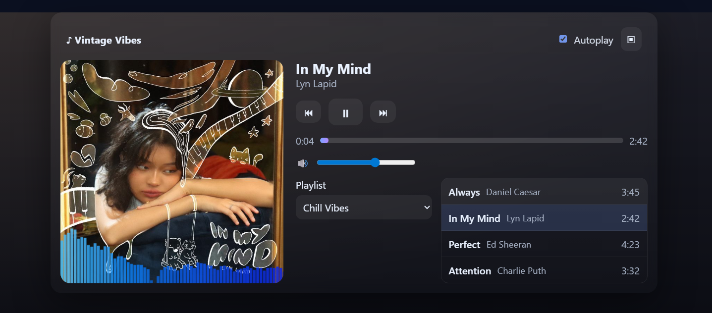
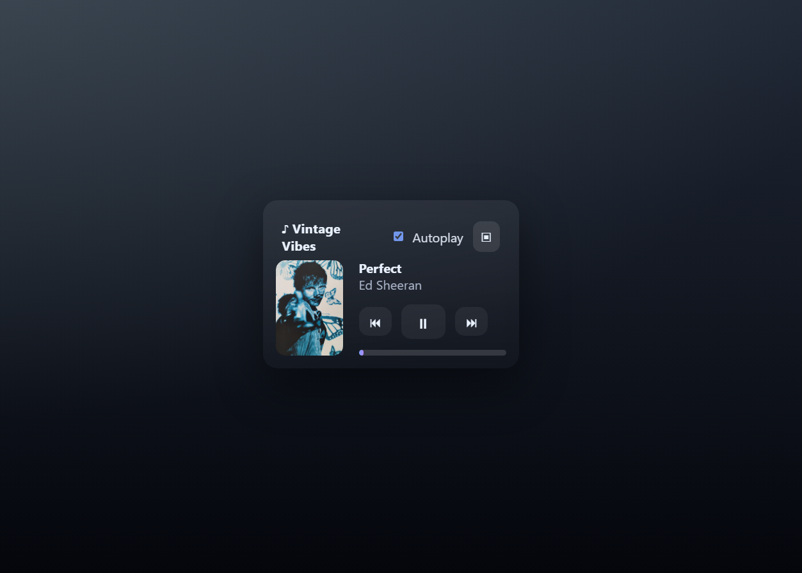

# 🎵 Music Player

A modern **music player app** built with **HTML, CSS, and JavaScript**.  
It supports playlists, displays song details, and includes playback controls with a sleek, responsive design.

---

## ✨ Features
- ▶ Play / ⏸ Pause / ⏭ Next / ⏮ Previous controls  
- 🎶 Playlist with active track highlight  
- 📊 Progress bar with seek option  
- 🔊 Volume control  
- 📱 Mini-player mode for smaller screens  

---

## 📸 Output




---

## 🚀 How to Use
1. Clone this repository:
   ```bash
   git clone https://github.com/Zyashi/CodeAlpha_MusicPlayer.git